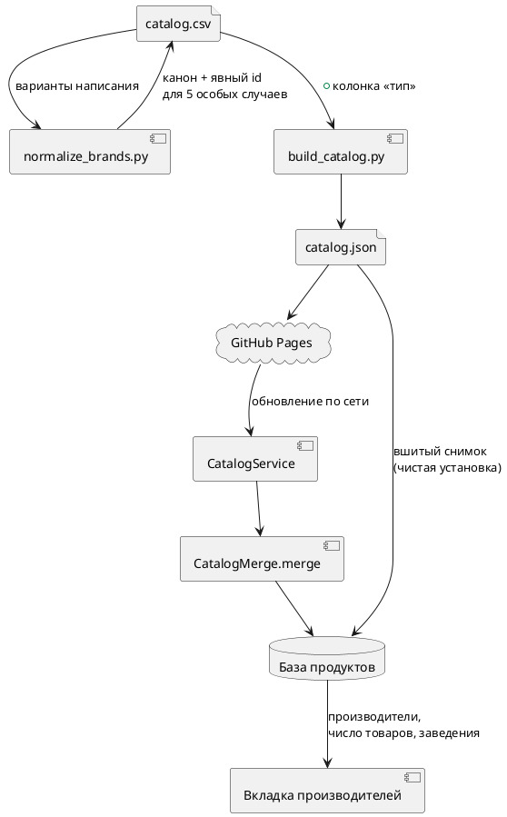

# Производители: дедупликация, выбор в поиске, заведения

Дата: 2026-08-14

## Зачем

Каталог наполнен 1 562 продуктами из Open Food Facts. Данные там народные, поэтому один
и тот же бренд записан по-разному («Вкусвилл» и «ВкусВилл»), а выбрать производителя в
поиске нельзя вообще. Плюс нужен признак заведения, чтобы блюда из сетей питания жили в
том же каталоге и отличались от упаковки.

Задача делится на четыре части: чистка производителей в таблице, колонка типа, вкладка
выбора производителя в приложении, уборка CI.

## Что решено не делать

**Отказ от публикации в Pages снят.** Обсуждался переход на «каталог едет только внутри
бандла», но публикация остаётся: `catalog.yml`, `CatalogService` и сетевое обновление не
трогаются.

Это важно, потому что при разборе всплыла особенность: вшитый каталог раскладывается
только в `AppData.initial`, то есть при чистой установке. На уже установленном приложении
новые продукты приходят исключительно по сети. Пока публикация жива, дыры нет. Если
когда-нибудь решим убрать сеть, одновременно придётся научить приложение применять вшитый
снимок на запуске при смене ревизии — иначе существующие пользователи перестанут получать
каталог совсем.

Также не делаем: отдельную сущность заведения с адресом и часами, экран меню, изменение
поиска по штрихкоду.

## Часть 1. Дедупликация производителей в таблице

Чистка делается **в данных**, а не группировкой в приложении: `catalog.csv` — источник
правды, и правильное написание должно лежать в нём.

### Масштаб

| Показатель | Значение |
|---|---|
| Различных написаний производителя | 910 |
| Групп с несколькими написаниями | 71 |
| Написаний внутри этих групп | 147 |
| Затронуто товаров | 376 |

### Ключ группировки

Два написания считаются одним производителем, если совпадают после приведения к нижнему
регистру, удаления пробелов, кавычек, апострофов, дефисов, подчёркиваний, точек и запятых,
и замены `ё` на `е`.

### Выбор канонического написания

Канон — **официальное написание бренда**, а не самое частое. Частота даёт неверный ответ:
«Вкусвилл» встречается 55 раз против 23 у «ВкусВилл», но официальное — второе.

Мэппинг ведётся явным словарём в `tools/normalize_brands.py`. Там, где официальное
написание достоверно неизвестно, берётся самое частое, и такая группа помечается как
предположение. Полная таблица из 71 строки показывается на вычитку до применения.

### Сохранение `id`

`id` товара собирается как `slugify(название-производитель)`, поэтому смена написания
производителя способна поменять `id` — а это значит, что у пользователя старая позиция
исчезнет из поиска, а рядом появится новая.

Проверено: из 76 слияний **71 не меняет `id`**, потому что `slugify` и так приводит к
нижнему регистру и отображает и `е`, и `ё` в `e`. Меняют `id` только пять, где разница в
пунктуации:

| Было | Станет | Старый id | Новый id |
|---|---|---|---|
| `Lays` | `Lay's` | `...-lays` | `...-lay-s` |
| `SenSoy` | `Sen Soy` | `...-sensoy` | `...-sen-soy` |
| `Mixbar` | `Mix Bar` | `...-mixbar` | `...-mix-bar` |
| `KClassic` | `K-Classic` | `...-kclassic` | `...-k-classic` |
| `Fruit-tella` | `Fruittella` | `...-fruit-tella` | `...-fruittella` |

Для этих пяти товаров прежний `id` прописывается явно в колонку `id`. Механика уже
предусмотрена в `catalog/README.md` для переименований. В итоге миграция нулевая.

Столкновений `id` после слияния — ноль (проверено по всей таблице).

### Защита от возврата вариантов

В `build_catalog.py` добавляется проверка: если два разных написания производителя сводятся
к одному ключу, сборка падает и называет оба. Без неё варианты наползут снова при следующем
импорте из OFF. Строгость та же, что уже действует для дублей `id` и штрихкодов.

## Часть 2. Колонка `тип`

В `catalog.csv` добавляется необязательная колонка `тип`. Допустимые значения: `ресторан`
либо пусто. Незнакомое значение роняет сборку — как и незнакомая единица измерения.

Поле проходит весь путь: `build_catalog.py` кладёт его в JSON, `CatalogProduct` его
декодирует, `makeFood()` и `applied(to:)` переносят в `Food`. Хранить признак на `Food`
обязательно: иначе после слияния каталога он теряется. `Food` декодируется терпимо, поэтому
сохранённые файлы прошлых версий читаются без миграции.

Помечаются найденные в каталоге реальные позиции сетей питания: Rostic's, «Пятёрочка Кафе»,
«Бургер Кинг». Последние две схлопнутся дедупликацией из части 1.

Меню заведений в каталоге практически нет, и это структурно: Open Food Facts построен
вокруг штрихкодов на упаковке, а у блюда в ресторане штрихкода нет. Поэтому здесь делается
только механизм, наполнение — отдельной задачей.

Отдельно про единицы: меню публикуют КБЖУ на порцию, а таблица хранит строго на 100 г.
Значит у блюд заполняется `единица=порция` и `вес_единицы_г`, а КБЖУ пересчитывается.
Правило существующее, новых полей не требует.

## Часть 3. Вкладка выбора производителя

Четвёртая вкладка называется **«Производители»** — не «Заведения»: в ней лежат и торговые
сети вроде ВкусВилла с Самокатом, и рестораны.

Вкладка показывает список производителей с числом товаров. Тап по строке остаётся внутри
вкладки и переключает её на список товаров этого производителя, с возвратом к списку
производителей. Обычный поиск и остальные вкладки при этом не затрагиваются. Заведения
помечены подписью «Заведение» и подняты наверх списка.

Список обязан иметь собственный поиск по названию: производителей 910, причём у 699 из них
ровно один товар, и только у 37 — пять и больше. Сортировка по числу товаров, дальше по
алфавиту.

Группировать написания в приложении не нужно — чистка сделана в данных, вкладка берёт поле
`производитель` как есть.

Логика (сбор списка, сортировка, пометка заведений, фильтр товаров по производителю)
выносится чистой функцией рядом с `CatalogMerge`, без обращения к состоянию и диску.

## Часть 4. CI

`.github/workflows/ios.yml` удаляется целиком.

Заодно объяснение недавнего падения: шаг запуска в симуляторе захардкожен на
`com.example.kbzhu`, а `PRODUCT_BUNDLE_IDENTIFIER` сменился на `com.safonov.kbzhu`.
Компиляция при этом проходила.

`catalog.yml` не трогается.

## Поток данных

## Тестирование

**Python, для таблицы и сборщика.** Варианты написания схлопываются в канон; канон берётся
из явного мэппинга, а не по частоте; пять особых случаев сохраняют прежний `id` через
колонку `id`; неизвестное значение в колонке `тип` роняет сборку; два написания одного
производителя роняют сборку.

**Swift, для приложения.** Существующий харнесс `tools/run_merge_tests.sh` расширяется:
признак заведения переживает слияние каталога и не теряется при обновлении продукта;
список производителей собирается с верным числом товаров; заведения идут первыми;
фильтр по производителю отдаёт только его товары.

Тесты слияния уже защищают главное правило: правка пользователя сильнее каталога.

## Риски

**Официальное написание — суждение.** Часть из 71 канона выбирается по моему знанию бренда.
Ошибка здесь не ломает приложение, но показывает пользователю неверное имя. Смягчение —
вычитка таблицы до применения и явный список групп, где написание угадано.

**Повторный импорт из OFF.** Новые варианты появятся при следующем пополнении каталога.
Смягчение — проверка в `build_catalog.py`, которая роняет сборку.
